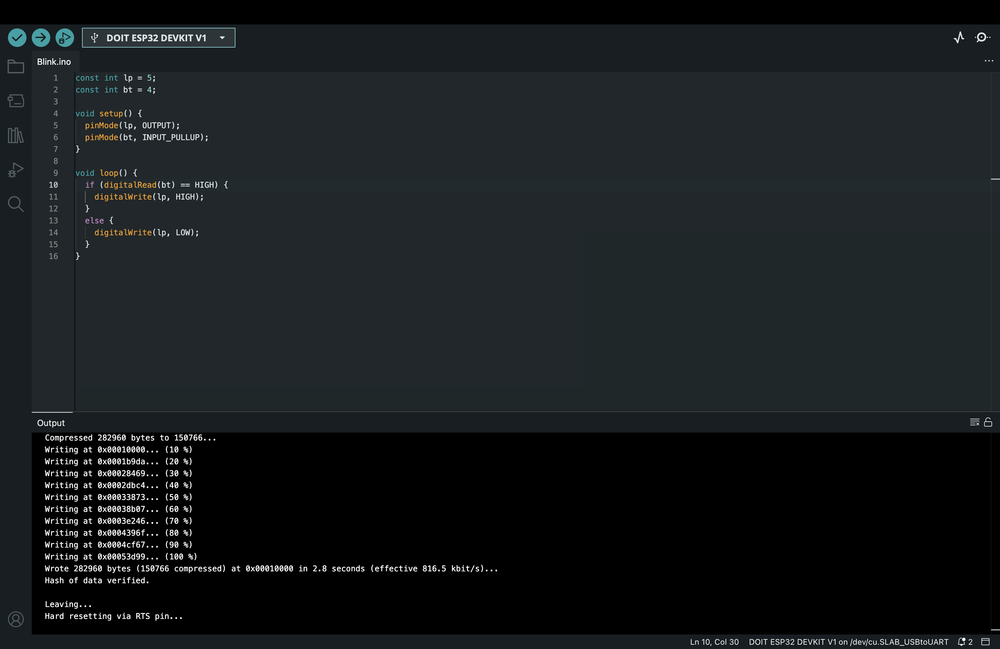

# IoT25-HW02

## Objective  
This assignment demonstrates basic digital I/O control using the ESP32 development board.  
A button is used as a digital input, and an LED is controlled as a digital output.  
When the button is pressed, the LED turns on; when released, the LED turns off.

---

## Arduino IDE Setting  
- Board: DOIT ESP32 DEVKIT V1  
- Port: /dev/cu.SLAB_USBtoUART



---

## Video
(https://youtube.com/shorts/1vR0KzYoQCI?si=XsyqElUkQWhNBOY8)

---

## Hardware Setting
- Button
  - GND  
  - GPIO 4  
- LED
  - Anode: GPIO 5
  - Cathode: 220Ω → GND

---

## Code

```cpp
const int lp = 5;
const int bt = 4;

void setup() {
  pinMode(lp, OUTPUT);
  pinMode(bt, INPUT_PULLUP);
}

void loop() {
  if (digitalRead(bt) == HIGH) {
    digitalWrite(lp, HIGH);
  }
  else {
    digitalWrite(lp, LOW);
  }
}
